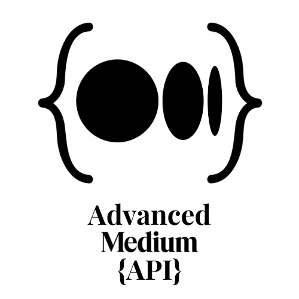

# Advanced Medium API

<p align="center">

</p>

### Contents

- [Overview](#1-overview)
- [API Details](#2-api-details)
  - [Medium feed in JSON](#21-medium-feed-in-json)
  - [Medium Advanced Data](#22-medium-advanced-data)
  - [Medium Customized Data](#23-medium-customized-data)
  - [Medium Customized Advanced Data](#24-medium-customized-advanced-data)
  - [Missing data of particular post](#25-missing-data-of-particular-post)
- [Built With](#3-built-with)
- [Installation](#4-installation)
- [Live Demo](#5-live-demohttpsadvanced-medium-apiherokuappcom)
- [License](#6-license)

## 1. Overview

Advanced [Medium](https://medium.com) API is a JSON-based API. All requests are made to endpoints beginning (`base URL`): [https://advanced-medium-api.herokuapp.com/](https://advanced-medium-api.herokuapp.com/) .All requests must be secure, i.e. `https`, not `http`.
This API aims to retrieve the missing parts of Medium's [Rss feed](https://help.medium.com/hc/en-us/articles/214874118-Using-RSS-feeds-of-profiles-publications-and-topics). All the requests are `GET` Requests.

## 2. API Details

Users could be able to get 5 types of responses from this API.

### 2.1 Medium feed in JSON

end point: `/medium/user/{userId}`

Medium gives public access to get [RSS feed](https://help.medium.com/hc/en-us/articles/214874118-Using-RSS-feeds-of-profiles-publications-and-topics) for the last 10 medium posts. This end point gives the direct JSON conversion of that RSS Feed.

[Sample JSON](./assets/docs/NormalData.json)

#### description for the `feed` object's key values

|      Key      |              Description               |
| :-----------: | :------------------------------------: |
|     `url`     |         URL of Medium profile          |
|    `title`    |           Title of your feed           |
|    `link`     |     Hyperlink to the feed profile      |
|   `author`    |              Empty string              |
| `description` | Phrase or sentence describing the feed |
|    `image`    |          Medium profile image          |

#### description for the array of `items` object's key values

|      Key      |                            Description                            |
| :-----------: | :---------------------------------------------------------------: |
|    `title`    |                     Title of the Medium post                      |
|   `pubDate`   |                 Published date of the Medium post                 |
|    `link`     |                   Hyperlink of the Medium post                    |
|    `guid`     | Hyperlink of the Medium post which contains Unique Id of the post |
|   `author`    |                  Medium display name of the user                  |
|  `thumbnail`  |                   Thumbnail of the Medium post                    |
| `description` |                     The medium post synopsis                      |
|   `content`   |                  The content of the Medium post                   |
|  `enclosure`  |                           Empty string                            |
| `categories`  |                      Tags of the Medium post                      |

### 2.2 Medium Advanced Data

end point: `/advanced/user/{userId}`

This endpoint return the response which contains the above Medium feed in JSON and moreover it contains the missing part of the Medium feed such as `clapCount`, `voterCount`, `responseCount`, `readingTime`.

[Sample JSON](./assets/docs/NormalAdvancedData.json)

#### description for missing part of Medium object's key values

|       Key       |                Description                |
| :-------------: | :---------------------------------------: |
|   `clapCount`   |    Number of Claps for the Medium post    |
|  `voterCount`   | Number of voters clap for the Medium post |
| `responseCount` |      Number of response for the post      |
|  `readingTime`  |     Reading Time for the Medium post      |

### 2.3 Medium Customized Data

end point: `/customized/user/{userId}`

This endpoint return the response which is the customized version of the JSON conversion of the Medium's RSS Feed. Order the Medium post's tags according to their use count among the latest 10 posts and the `tagOrder` return that tags' order rank. Medium's latest 10 posts were divide by 3 and every 3 posts pushed in an array and those arrays pushed in one array.

[Sample JSON](./assets/docs/CustomizedData.json)

#### description for customized Medium object's key values

|      Key      |                               Description                               |
| :-----------: | :---------------------------------------------------------------------: |
|   `author`    |                     Medium display name of the user                     |
|   `avatar`    |                          Medium profile image                           |
|   `content`   |                     The content of the Medium post                      |
|    `link `    |    Hyperlink of the Medium post which contains Unique Id of the post    |
|  `postImage`  |                      Thumbnail of the Medium post                       |
| `profileLink` |                     Hyperlink to the Medium profile                     |
|   `pubDate`   |                    Published date of the Medium post                    |
|     `tag`     | Most suitable tag for the Medium post among other tags of a Medium Post |
|  `tagOrder`   |                            tags' order rank                             |
|    `title`    |                        Title of the Medium post                         |

### 2.4 Medium Customized Advanced Data

end point: `/advanced/customized/user/{userId}`

This endpoint return the response which contains the above Medium feed in JSON and moreover it contains the [missing part of the Medium feed](#description-for-missing-part-of-medium-objects-key-values) such as `clapCount`, `voterCount`, `responseCount`, `readingTime`.

[Sample JSON](./assets/docs/CustomizedAdvancedData.json)

### 2.5 Missing data of particular post.

end point: `/medium/post/{postId}`

User could able to get only the missing part (`clapCount`, `voterCount`, `responseCount`, `readingTime`) of Medium feed.

[Sample JSON](./assets/docs/AdvancedPostDetails.json)

## 3. Built with

- [express](https://expressjs.com/) - A minimal and flexible Node.js web application framework
- [cors](https://github.com/expressjs/cors) - Allows users to relax the security applied to an API
- [cheerio](https://cheerio.js.org/) - Tool for parsing HTML and XML in Node. js
- [Axios](https://github.com/axios/axios) - Promise based HTTP client
- [request](https://react-countup.now.sh/) - Simplest way possible to make http calls

## 4. Installation

To setup the app for development on your local machine, please follow the instructions below:

1. Clone the repo to your machine

   ```bash
   git clone https://github.com/sabesansathananthan/advanced-medium-api.git
   cd advanced-medium-api
   ```

2. Install packages

   ```bash
   npm install
   ```

3. Run the development server

   ```bash
   node index.js
   ```

4. Visit <http://localhost:9002>

## 5. [Live Demo](https://advanced-medium-api.herokuapp.com/)

Don't forget to give a star :star: for this repo :slightly_smiling_face:

## 6. License

This project is licensed under the MIT License - see the [LICENSE](./.github/LICENSE) file for details
